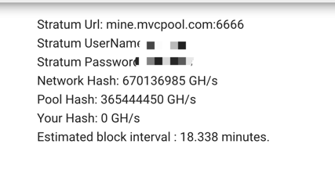

# mvcpool-manual

Welcome to MvcPool.com

MvcPool is a mvc specialized mining pool supported by founding members of mvclabs. It mines mvc only and fully optimized to fit the increasing transaction processing demand of mvc network.

## Pool Attributes

**Algorithm** : SHA256, Same like BTC,BCH,BSV etc.

**Payout Method** : PPLNS(Pay per last N shares)

**N calculation** : N = (blockDiff * 5) / shareDiff

**Share diff** : 2000000

**Mature Requirement** : 100 Confirmations

**Fee Rate** : 2% Block rewards

**AsicBoost** : Supported

**Mining url** : mine.mvcpool.com:6666 (please register first)

## Steps

### Register pool account

Testnet:
https://console-testnet.mvcpool.com/

Mainnet:
https://console.mvcpool.com/

Register and login your account first, keep your password safe.

### See your Connection Dashboard

### Connect To The Pool

Use the connection url , the stratum userName and password to connect to the pool, If successfully connected, you should see your hashrate displayed within 5 min.

## FAQ

### Mining Related

#### What is PPLNS

https://medium.com/luxor/mining-pool-payment-methods-pps-vs-pplns-ac699f44149f

Pay Per Last N Share or commonly known as PPLNS is another popular payment method, which offers payment to miners as a % of shares they contribute to the total shares (N).

#### Why I cannot see my hashrate

Your hash rate is calculated by how many shares you submitted in the past five minutes window. If your hash rate is too low to find a share in 5mins, you may not see your hashrate.

If you hashrate is enough, please confirm your rejection rate. Normally valid shares do not get rejected, if it keeps rejected, please stop using and contact the team.

#### Why MvcPool hash is higher than NetworkHash

The pool hash and user hash are real time calculated(5min window), while the networkHash is an average of the last day. So burst pool hash can surpass network hash.

Real time network hash cannot be calculated, it can only be estimated by moving average of last blocks.

#### Why my payout takes 100 confirmation to mature

Your payout comes from real founded block coinbase reward. Coinbase reward takes 100 confirmation to be spendable, that is a common feature of Bitcoin like blockchains.(same logic to BTC,BCH,BSV)

After it reaches 100 confirmation, your payout will be sent to your pool wallet instantly, you can withdraw that.

#### Do you support Asicboost

Yes we support asicboost, and recommend miners to activate it. It will increase ROI by around 20%.

### Wallet Related

#### Why your pool have a wallet integrated

Because of the PPLNS nature, It's easier to manage and distribute rewards by user account. This wallet address will not change, it's bounded to your account.

#### What if I lost my password

Contact the team, use your registered email address to recover.

#### Can I use MVCPool wallet address to receive private mining coinbase reward

No, we suggest not. Because the wallet is not designed to receive coinbase from private mining, if you do that, your wallet will be unspentable until your private coinbase get 100 confirmations.

### Team and Contact

#### Who maintains this pool

MVC infrastructure team maintains the pool, including daily operation, pool development, custom support.

#### Where is the team

The team is mainly located in Tokyo Japan. Some of the members work globally.

#### How does the pool profit

We take mining fees to maintain the pool. To cover costs like development, cloud computing and operation.

We also initiated a draft to lower down the fee to zero in order to benefit all mvc miners. The cost will be covered by MVC treasury as infrastructure investment. The draft will be open discussed and voted after dao established. 

#### How to Contact the team

Join our discord: https://discord.gg/3tavfAKg

Find MvcPool channel and raise your questions. Your request will be responded asap.